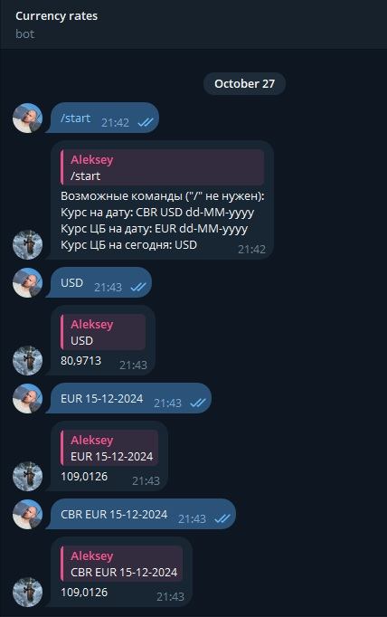

# 💱 Telegram Bot для курсов валют

Этот проект представляет собой Telegram-бота, который получает и предоставляет пользователям курсы валют. Он состоит из двух основных сервисов:

1.  **[Сервис Telegram-бота:](telegram-bot)** Взаимодействует с пользователями через Telegram API, обрабатывает команды и получает курсы.
2.  **[Сервис курсов валют:](cbr-currency-rates-service)** Получает данные о курсах валют из внешних источников (например, Центральный банк России - ЦБР) и предоставляет их через API.

## ⚙️ Предварительная настройка

Перед запуском выполните следующие шаги:

### Создание Telegram Bot:

1. Создайте бота через [BotFather](https://t.me/BotFather).
2. Получите `YOUR_TELEGRAM_BOT_TOKEN`.

## 🛠 Конфигурация проекта

### Создайте файл переменных окружения `secrets/telegram-token.env`

Укажите полученные данные от BotFather.

```env
TELEGRAM_BOT_TOKEN=YOUR_TELEGRAM_BOT_TOKEN
```

## 🚀 Запуск приложения

### 1. Склонируйте репозиторий и перейдите в его директорию:

```bash
git clone https://github.com/alextim1508/currency-rates-telegram-bot.git
cd currency-rates-telegram-bot
```

### 2 Соберите JAR-файлы проекта:

```bash
./gradlew bootJar 
```

### 3. Запустите сервисы с помощью Docker Compose:

```bash
docker-compose -f docker-compose.yml up -d --build
```

Telegram-бот теперь должен работать и опрашивать обновления от Telegram. Вы можете взаимодействовать с ним, отправляя команды, чтобы получить курс валюты.

## 💵 Использование

`[источник] <код_валюты> [дата]`: Получает курс обмена для указанного кода валюты.

Если дата не указана, используется текущая дата.

Если не указан источник, то используется ЦБР. 

* Пример: `USD`
* Пример: `EUR 25-10-2023`
* Пример: `CBR EUR 25-10-2023`

